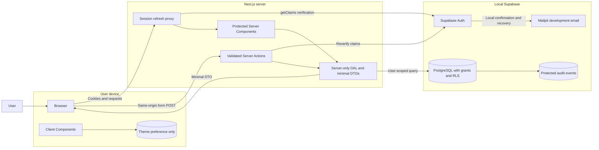
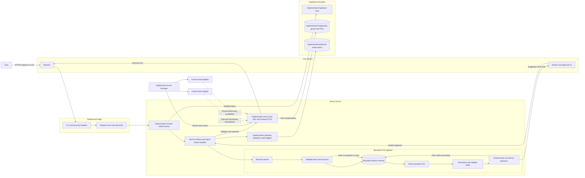

# SubTrack threat model

Threat-model date: 2026-09-17

## Purpose and scope

This threat model covers the implemented local authentication, subscription-management, and bounded fictional CSV-import boundaries through Phase 4, plus planned insight, privacy, deployment, and provider boundaries.

The model uses STRIDE:

- **Spoofing:** Pretending to be another user, service, or trusted provider.
- **Tampering:** Changing records, requests, files, configuration, or audit evidence.
- **Repudiation:** Denying an action when reliable evidence is absent.
- **Information disclosure:** Exposing identity, financial, session, or secret data.
- **Denial of service:** Exhausting application, parser, database, or provider capacity.
- **Elevation of privilege:** Gaining operations or data beyond the caller's authorization.

## System inventory

### What exists now

- Public Next.js routes for landing, sign-up, sign-in, password recovery, and email confirmation.
- Protected, dynamically rendered routes for onboarding, dashboard, subscriptions, subscription details, import preview, calendar, savings, and settings.
- Supabase Auth with request-scoped SSR clients, HttpOnly `SameSite=Lax` cookies, refresh-token rotation, verified `getClaims()` identity, and a Next.js 16 proxy.
- PostgreSQL tables for every first-release entity, with constraints, owner-safe foreign keys, indexes, revoked default grants, and RLS enabled.
- Owner-scoped profile, budget, savings-goal, subscription, import, mapping, transaction, merchant-alias, and suggestion reads.
- A server-only DAL that selects minimal columns and maps records into route-specific browser DTOs.
- Server Actions for authentication, onboarding, preferences, subscription mutations, and import-review decisions.
- An authenticated same-origin CSV Route Handler with streaming byte limits, account and network-aware throttling, and one-active-import enforcement.
- A provider-neutral importer contract, maintained CSV parser, strict mapping schema, merchant normalizer, and deterministic recurrence detector.
- User-scoped import and transaction fingerprints with database uniqueness and bounded atomic persistence functions.
- Redacted audit triggers for profile, subscription, budget, and savings-goal row changes.
- Client Components for navigation, theme selection, filtering, CSV mapping and preview, review decisions, savings selection, and validated forms.
- Request memory only for raw CSV bytes and React component memory for unsaved file selection and savings choices.
- A `next-themes` local-storage entry containing only the selected theme.
- A public fictional CSV sample.
- HTTPS-only provider links with visible hostnames and opener isolation.
- Build-time Google font retrieval through `next/font`, with self-hosted browser delivery.
- A tested CSP and supporting browser-security headers.

### What is partially scaffolded

- Price history, reminders, and cancellation guides exist with RLS but remain inaccessible until their owning phases.
- Budgets and savings goals persist, while Phase 5 calculations and workflows remain incomplete.
- Audit events cover current writes, while deployment monitoring, alerts, and retention remain unimplemented.

### What is planned

- Price-change confirmation, overlap insights, reminders, and complete savings calculations in Phase 5.
- Account export, account deletion, and retention processing.
- Future bank and email adapters, which are outside the first release.

## Assets

| Asset                                             | Sensitivity    | Current state                    | Required protection                                                              |
| ------------------------------------------------- | -------------- | -------------------------------- | -------------------------------------------------------------------------------- |
| User identity and verified email                  | High           | Local Supabase Auth              | Server-verified authentication, generic responses, minimal disclosure            |
| Authentication and refresh sessions               | Critical       | HttpOnly cookie sessions         | Verification, rotation, bounded lifetime, revocation, no browser storage or logs |
| User profile and preferences                      | Medium         | Owner-scoped PostgreSQL          | Owner authorization, minimal DTO, export and deletion                            |
| Subscription records                              | High           | Owner-scoped CRUD                | Owner authorization, RLS, integrity, minimal browser exposure                    |
| Transaction records and merchant descriptions     | High           | Owner-scoped normalized fixtures | Owner isolation, redaction, bounded retention, no analytics or AI transfer       |
| Uploaded financial statement                      | High           | Bounded request memory only      | Strict limits, no persistence or logs, production resource verification          |
| Import metadata and mappings                      | Medium to High | Owner-scoped PostgreSQL          | Owner isolation, deduplication, safe errors, retention                           |
| Merchant aliases                                  | Medium         | Owner-scoped reads               | Owner isolation; shared aliases require a separate trust model                   |
| Price history                                     | High           | One fictional prior price        | Integrity, owner isolation, confirmation workflow                                |
| Reminder records                                  | Medium         | Fictional UI only                | Owner isolation, safe delivery, no sensitive payload in notifications            |
| Budget and savings values                         | High           | Owner-scoped PostgreSQL          | Owner isolation, no logs, accurate integer calculations                          |
| Cancellation URLs, instructions, phone, and notes | Medium to High | Fixed example URL only           | HTTPS allowlist, provenance, owner authorization, anti-phishing copy             |
| Audit events                                      | High           | Trigger-written, no client grant | Append orientation, tamper resistance, strict read access, no sensitive content  |
| Environment and Supabase secrets                  | Critical       | Placeholders only                | Secret manager, server-only import boundary, rotation, least privilege           |
| Future bank connection tokens                     | Critical       | Not implemented                  | Provider adapter isolation, encryption, revocation, never bank credentials       |
| Future email access tokens                        | Critical       | Not implemented                  | Minimal scopes, adapter isolation, encryption, revocation                        |
| Source, lockfile, and build artifacts             | High           | Local workspace                  | Version control integrity, reviewed changes, clean reproducible build            |

## Threat actors

| Actor                                      | Capability and motivation                                                                                    |
| ------------------------------------------ | ------------------------------------------------------------------------------------------------------------ |
| Unauthenticated internet user              | Enumerates routes, sends crafted requests, frames pages, probes errors, and automates abuse                  |
| Malicious authenticated user               | Controls valid account inputs and identifiers and attempts horizontal access to another user's data          |
| Attacker with a stolen session             | Acts as the victim until revocation or expiry and attempts sensitive operations                              |
| Malicious uploaded file                    | Exploits parser ambiguity, resource use, formula handling, logs, or stored rendering                         |
| Compromised dependency                     | Executes during install/build or in the server/browser with package privileges                               |
| Accidental developer exposure              | Commits secrets, logs financial data, uses real fixtures, or sends data to an unapproved service             |
| Misconfigured deployment                   | Caches private responses, omits TLS/security headers, exposes debug output, or grants public database access |
| Overprivileged database client             | Uses a server secret or broad grant to bypass RLS and affect many users                                      |
| Curious or malicious support administrator | Searches or exports user financial data beyond a support purpose                                             |
| Automated bot                              | Brute-forces authentication, floods imports, enumerates accounts, or consumes provider quotas                |

## Entry points

### Current

- Public HTTP requests to landing and authentication routes.
- Session-bound requests to protected dynamic routes and user-owned object IDs.
- Auth Server Actions for registration, sign-in, sign-out, recovery, password update, onboarding, and preferences.
- Subscription and import-review Server Actions.
- The email confirmation Route Handler and session-refresh proxy.
- The authenticated `POST /api/imports` CSV body and mapping headers.
- User-scoped Supabase Data API requests from server-only clients.
- Client-side filtering and savings selection over minimal serialized DTOs.
- Public download of the fictional CSV.
- User click on a provider link.
- npm install/build/test toolchain and its package lifecycle scripts.

### Planned

- Price-history, overlap, reminder, budget, and savings mutations.
- Data export.
- Cancellation URLs and user notes.
- Account deletion and cross-device session revocation.
- Administrative support tools and audit review.
- Future bank and email OAuth callbacks, tokens, and webhooks.

## Trust boundaries

1. **Internet to deployment edge:** Untrusted requests cross TLS termination, request-size policy, and rate limiting.
2. **Browser to Next.js server:** Cookies, form data, route parameters, headers, and files remain untrusted even when sent by an authenticated browser.
3. **Server Component to Client Component:** Every prop crossing this boundary becomes browser-accessible serialized data.
4. **Server entry point to DAL:** Authentication, authorization, validation, and transaction boundaries must occur before data access or mutation.
5. **DAL to Supabase Auth and PostgreSQL:** User-scoped access requires verified claims, minimal grants, and RLS; an elevated secret bypasses RLS.
6. **Import handler to parser:** Raw bytes are hostile and can consume CPU, memory, disk, or parser state.
7. **Parser to normalized domain:** Parsed strings remain untrusted and can attack HTML, URLs, logs, exports, or deduplication logic.
8. **Application to logs and audit store:** Event data can leak sensitive content or inject forged records unless allowlisted and encoded.
9. **Application to external providers:** Bank, email, notification, and analytics providers create new confidentiality and availability dependencies.
10. **Developer/CI to package registry and artifacts:** Dependencies and lifecycle scripts execute with developer or build permissions.

## Current application data flow

Current trust observations:

- Public preview and downloadable CSV content remain fictional.
- Private profile, budget, savings-goal, subscription, transaction, and import-review records are user-owned.
- The browser receives route-specific DTOs, not database rows.
- Every protected request verifies signed claims, and database RLS independently enforces ownership.
- No elevated database credential exists in application code or browser bundles.
- Package retrieval and build-time font retrieval remain supply-chain boundaries.

## Implemented subscription mutation and statement import flow

The following diagram shows the implemented Phase 3 and Phase 4 mutation boundary.

## Threat scenarios

Likelihood and impact describe the current system or the system after the relevant future feature exists. Planned attack scenarios do not assert current exploitability.

| ID    | STRIDE and actor                                         | Asset, entry point, and boundary                            | Attack scenario                                                                                                              | Existing control                                                                                                                                        | Missing control                                                                     | Likelihood  | Impact   | Recommended mitigation and blocking phase                                                                                                                        |
| ----- | -------------------------------------------------------- | ----------------------------------------------------------- | ---------------------------------------------------------------------------------------------------------------------------- | ------------------------------------------------------------------------------------------------------------------------------------------------------- | ----------------------------------------------------------------------------------- | ----------- | -------- | ---------------------------------------------------------------------------------------------------------------------------------------------------------------- |
| TM-01 | Spoofing; unauthenticated user                           | Identity/session; auth endpoint; browser-to-server          | The attacker forges or replays cookie content and server code trusts unverified session data.                                | Request-scoped Supabase SSR clients call `getClaims()` in proxy, layouts, and actions; forged cookies redirect to sign-in.                              | Hosted signing-key and provider configuration review.                               | Low         | High     | Preserve verified-claims checks at every protected entry and test hosted configuration before deployment.                                                        |
| TM-02 | Spoofing; stolen-session attacker                        | Session and account; every protected operation              | A stolen session remains valid through logout, password reset, or excessive inactivity.                                      | HttpOnly `SameSite=Lax` cookies, token rotation, 24-hour local timebox, 8-hour inactivity timeout, logout and recovery tests.                           | Cross-device revocation and recent-authentication checks for Phase 6 operations.    | Medium      | High     | Add global session revocation and step-up authentication before account deletion and identity changes. Phase 6.                                                  |
| TM-03 | Elevation and disclosure; malicious user                 | Any user-owned row; dynamic ID; server-to-DAL and DAL-to-DB | The user changes a record ID and reads or modifies another user's data.                                                      | Verified owner filters, deny-by-default grants, RLS, owner-blind 404s, 49 pgTAP assertions, and browser two-user tests.                                 | Mutation-specific policies for each future feature.                                 | Low         | High     | Add grants and policies only with the owning phase and repeat owner, non-owner, and anonymous tests.                                                             |
| TM-04 | Tampering; malicious user                                | Ownership fields; mutation input; browser-to-server         | The user supplies another `user_id` during create or update and reassigns a record.                                          | Onboarding derives ownership from `auth.uid()`; RLS `with check` and column grants block identity writes.                                               | Subscription mutation DTOs and policies are deferred to Phase 3.                    | Low         | High     | Derive ownership inside every Phase 3 DAL mutation and test mass assignment plus ID tampering.                                                                   |
| TM-05 | Elevation; overprivileged client or developer            | Supabase server secret; environment-to-DAL                  | A service secret is imported into browser code or used in normal requests, bypassing RLS.                                    | Application code uses only the publishable key; server modules use `server-only`; local test admin key is resolved at runtime from ignored CLI state.   | Production secret manager, access review, and bundle scan.                          | Low         | Critical | Do not provision an elevated key to normal app paths; verify production bundles and rotate any exposed key. Before deployment.                                   |
| TM-06 | Disclosure/spoofing; misconfigured deployment            | Session and private HTML; edge cache                        | A CDN caches private HTML or a refresh response with `Set-Cookie` and serves it to another user.                             | Auth refresh propagates cache headers, protected routes are dynamic, and `next start` tests require `private` plus `no-store`.                          | Hosted CDN and reverse-proxy verification.                                          | Low         | Critical | Repeat two-user response and cookie-isolation tests against production-equivalent hosting before deployment.                                                     |
| TM-07 | Denial of service; bot or malicious file                 | Import service; file body; edge-to-parser                   | Repeated oversized, deeply quoted, or oversized-field CSV files exhaust CPU, memory, or disk.                                | Authentication precedes body reads; streaming 5 MiB cap, fixed parser dimensions, direct-RPC JSON caps, attempt throttles, and one active import limit. | Production ingress, worker/load, memory, timeout, and queue verification.           | Low locally | High     | Keep local limits fixed; verify a trusted ingress and production resource budget before deployment.                                                              |
| TM-08 | Tampering/injection; malicious file                      | Merchant text and headers; parser-to-domain/log/browser     | A cell contains HTML, controls, bidi characters, or CR/LF sequences that attack rendering, logs, or reviewer interpretation. | Strict UTF-8 and control checks, NFC normalization, bounded fields, JSX text rendering, generic errors, and exact audit allowlists.                     | Broader confusable policy if international formats are added.                       | Low         | High     | Preserve canonical validation and text-only rendering; add fuzzing before broad format support.                                                                  |
| TM-09 | Injection; malicious user or file                        | CSV export; domain-to-spreadsheet                           | Formula-prefixed merchant or note data executes when an exported CSV opens in spreadsheet software.                          | The shared CSV serializer quotes cells and neutralizes ASCII and full-width formula prefixes; fixture tests pass.                                       | Apply the helper to every Phase 6 export endpoint and test the final artifact.      | Low         | High     | Keep export central and target-specific; do not construct CSV with ad hoc string joining.                                                                        |
| TM-10 | Tampering/disclosure; malicious user                     | Import hash and rows; DAL-to-DB                             | Races or globally scoped hashes let one user suppress, infer, merge, or approve another user's import.                       | User-scoped cryptographic hashes, unique constraints, advisory locks, opaque permits, owner checks, and cross-user/concurrency tests.                   | Production database load verification.                                              | Low         | High     | Preserve atomic controlled functions and repeat collision tests after schema changes.                                                                            |
| TM-11 | Disclosure; misconfiguration or support actor            | Raw statement; parser temporary storage                     | Raw files remain after error, timeout, restart, or support debugging and become readable later.                              | Raw bytes use bounded request memory only, are never stored or logged, and buffers are cleared on success and failure.                                  | Runtime heap reclamation and production memory-dump policy.                         | Low locally | High     | Keep source bytes out of persistence; verify production memory, crash-dump, and observability policies before real statements.                                   |
| TM-12 | Tampering/elevation; compromised dependency              | Source, CI credentials, artifact; registry-to-build         | A malicious dependency or lifecycle script steals tokens or modifies output.                                                 | Lockfile integrity, registry-only sources, zero advisories, production signatures verified.                                                             | Complete provenance policy, isolated CI, continuous monitoring.                     | Medium      | High     | Use clean locked installs, least-privilege CI tokens, package-change review, and advisory/provenance gates. Before public deployment.                            |
| TM-13 | Disclosure/repudiation; support administrator            | User records and audit logs; support tooling                | Support staff browse or export financial details without a documented purpose or attribution.                                | No support tooling exists.                                                                                                                              | Roles, purpose limitation, masked DTOs, approval, access audit.                     | Medium      | High     | Create separate support roles and views, default-deny access, prohibit impersonation by default, and audit every access. Before support tooling.                 |
| TM-14 | Denial of service/spoofing; automated bot                | Auth, reset, import, export; internet-to-edge               | Automation enumerates accounts, guesses passwords, floods imports, or consumes provider quotas.                              | Generic auth responses, local Auth limits, five attempts per account per hour, network-aware limits, and one active import.                             | Trusted proxy validation, hosted limits, alerting, and optional CAPTCHA.            | Low locally | High     | Verify ingress strips forwarding headers and test hosted Auth and import limits before deployment.                                                               |
| TM-15 | Tampering/repudiation; malicious user or admin           | Audit events; DAL-to-audit store                            | An actor edits or deletes evidence of export, deletion, failed access, or administrative reads.                              | Database triggers append redacted row-change events; client roles have no direct audit-table grant.                                                     | Hosted retention, alerting, clock sync, and administrator-access audit.             | Low         | High     | Configure operational retention and monitoring before deployment; add event types with each sensitive phase.                                                     |
| TM-16 | Spoofing/injection; compromised guide author             | Cancellation URL; database-to-browser                       | A trusted-looking guide directs the user to a malicious or non-HTTPS destination.                                            | HTTPS-only validation, render-time revalidation, visible hostname, `noopener noreferrer`, and provider-confirmation copy.                               | Provenance, moderation, verification date, and report flow for shared guides.       | Low         | High     | Preserve URL controls in Phase 3 and add provenance and moderation before shared guidance in Phase 6.                                                            |
| TM-17 | Disclosure/elevation; provider compromise or developer   | Bank/email tokens; provider adapter boundary                | An overly broad token leaks through logs, browser props, database query, or support tooling.                                 | Interfaces are planned; integrations are deferred.                                                                                                      | Scope inventory, encryption, adapter isolation, rotation/revocation, vendor review. | Medium      | Critical | Request minimum read-only scopes, isolate secrets, never return tokens, revoke on disconnect, and threat-model each provider. Future integration gate.           |
| TM-18 | Disclosure/injection; malicious input or developer error | Logs/errors; application-to-log/user                        | A stack trace, request body, transaction description, or token reaches logs or a user-facing error.                          | Generic errors and exact import audit allowlists exclude filenames, rows, merchant text, amounts, tokens, and parser details.                           | Deployment log-pipeline validation and alerting.                                    | Low         | High     | Keep bodies and secrets out of logs and scan hosted logs before real-data use.                                                                                   |
| TM-19 | Tampering; unauthenticated site                          | State-changing operation; browser-to-server                 | A cross-site request triggers a mutation through ambient cookies.                                                            | Next.js Server Actions enforce same-origin behavior; cookies are `SameSite=Lax`; every protected action rechecks claims.                                | Production allowed-origin review and regression tests for new Route Handlers.       | Low         | High     | Keep mutations POST-only, validate origin where handlers bypass Server Actions, and test each new entry point.                                                   |
| TM-20 | Disclosure/elevation; third-party script compromise      | Browser DOM and session-bound UI; external script boundary  | Analytics or a tag manager reads financial content from the DOM and sends it to a vendor.                                    | No runtime third-party script exists; fonts are self-hosted.                                                                                            | Policy preventing unreviewed scripts and analytics on private pages.                | Medium      | High     | Default to no third-party runtime script on authenticated pages; require vendor/data-flow review, CSP, and minimal server-side events. Before public deployment. |

## Current and planned RLS verification matrix

All rows below assume these baseline controls:

- RLS enabled and forced where appropriate.
- Existing `anon` and `authenticated` grants revoked before least-privilege grants are added.
- Policies explicitly target `authenticated`.
- `user_id` comes from verified `auth.uid()`, not trusted client input.
- Anonymous and non-owner access is denied for every operation.
- `select`, `insert`, `update`, and `delete` policies are separate.
- Update uses both `using` and `with check`.
- Policy columns have supporting indexes.
- Every allowed write test uses `returning`; every denied write proves the target row stayed intact.

`Allow` means the owner can perform the operation through an approved application path. `Deferred` means the table receives no client-role grant until its owning feature phase.

| Table                        | Owner select                                    | Owner insert           | Owner update               | Owner delete         | Anonymous | Other user | System and verification notes                                                                                          |
| ---------------------------- | ----------------------------------------------- | ---------------------- | -------------------------- | -------------------- | --------- | ---------- | ---------------------------------------------------------------------------------------------------------------------- |
| `profiles`                   | Allow                                           | Auth trigger only      | Allowed preference columns | Account cascade only | Deny all  | Deny all   | Implemented; identity columns are not writable and tests cover reassignment and cascade                                |
| `subscriptions`              | Allow                                           | Allowed manual columns | Allowed manual columns     | Allow owner          | Deny all  | Deny all   | Implemented with server-derived ownership, protected provenance columns, optimistic locking, and redacted audit events |
| `transactions`               | Allow owner                                     | Controlled RPC         | Controlled RPC             | Parent cascade/RPC   | Deny all  | Deny all   | Normalized fields only; user-scoped fingerprint uniqueness and owner-safe parent links                                 |
| `statement_imports`          | Allow owner                                     | Controlled RPC         | Controlled RPC             | Controlled RPC       | Deny all  | Deny all   | One active import, user-scoped file hash, bounded summaries, and no raw bytes or filename                              |
| `import_column_mappings`     | Allow owner                                     | Controlled RPC         | Deny                       | Parent cascade       | Deny all  | Deny all   | Mapping ownership agrees with the parent import; date format and header lengths are constrained                        |
| `merchant_aliases`           | Allow owner                                     | Deferred               | Deferred                   | Deferred             | Deny all  | Deny all   | User aliases remain separate from any future moderated global aliases                                                  |
| `import_suggestions`         | Allow owner                                     | Controlled RPC         | Controlled RPC             | Parent cascade       | Deny all  | Deny all   | Optimistic review decisions and owner-safe import and subscription relationships                                       |
| `subscription_price_history` | Deferred to Phase 5                             | Deferred               | Deferred                   | Deferred             | Deny all  | Deny all   | Prefer append through a controlled domain operation; users confirm but do not rewrite history silently                 |
| `reminders`                  | Deferred to Phase 5                             | Deferred               | Deferred                   | Deferred             | Deny all  | Deny all   | Notification worker access needs a separate minimal role and redacted payload                                          |
| `budgets`                    | Allow                                           | Allowed owner columns  | Allowed owner columns      | Allow                | Deny all  | Deny all   | Implemented for onboarding and settings; identity columns are not writable                                             |
| `savings_goals`              | Allow                                           | Allowed owner columns  | Allowed goal columns       | Allow                | Deny all  | Deny all   | Implemented; realized savings remains non-writable until confirmed cancellation workflows                              |
| `cancellation_guides`        | Deferred to Phase 6                             | Deferred               | Deferred                   | Deferred             | Deny all  | Deny all   | User-owned guides and future community guides require separate tables or explicit moderation states                    |
| `audit_events`               | Deny direct table access; optional filtered DTO | Deny                   | Deny                       | Deny                 | Deny all  | Deny all   | Append through a controlled server operation or database trigger; no service key in normal browser-facing path         |

For every table, pgTAP must test:

1. `anon` cannot select, insert, update, or delete.
2. The owner can perform only the operations marked `Allow`.
3. Another authenticated user cannot read or mutate the owner's row.
4. The owner cannot assign or change ownership to another user.
5. A denied update or delete leaves the target row unchanged.
6. Parent-child foreign keys cannot connect rows owned by different users.
7. Views use `security_invoker = true` or remain outside exposed schemas.
8. Security-definer functions live in a private schema, set an empty `search_path`, use schema-qualified names, and expose only necessary execution grants.

## Implemented statement import security contract

These values are conservative starting limits for a personal statement import. Load tests can lower them. Raising them requires a reviewed resource model.

| Control           | Proposed first-release rule                                                                                                                                                      |
| ----------------- | -------------------------------------------------------------------------------------------------------------------------------------------------------------------------------- |
| Authentication    | Verify the session before reading the request body                                                                                                                               |
| Authorization     | Bind every import and derived row to the verified user; never trust submitted `user_id`                                                                                          |
| Rate limit        | Maximum five attempts per account per hour, one active import per account, plus network-level abuse detection                                                                    |
| Request body      | Stream and stop at 5 MiB; reject missing or excessive `Content-Length` where available but do not trust it alone                                                                 |
| File count        | Exactly one file per import request                                                                                                                                              |
| Extension         | Decoded final extension must be exactly `.csv`; reject double extensions, null bytes, leading dots, and path components                                                          |
| Filename          | Do not store or use the supplied filename for paths; retain at most a sanitized display label of 128 characters if product-approved                                              |
| MIME              | Allow `text/csv` and narrowly documented compatibility values only as a hint; never trust MIME as proof                                                                          |
| Signature         | CSV has no reliable magic signature; validate bounded textual structure instead of claiming signature verification                                                               |
| Encoding          | UTF-8 with an optional UTF-8 BOM only for the first release; reject invalid byte sequences, UTF-16/32, null bytes, and unsupported encodings                                     |
| Delimiter         | Comma only in the first release; add other delimiters through separately tested adapters                                                                                         |
| Rows              | At most 10,000 data rows after one header row                                                                                                                                    |
| Columns           | At most 64 columns                                                                                                                                                               |
| Line length       | At most 64 KiB decoded                                                                                                                                                           |
| Field length      | At most 8 KiB decoded; use tighter canonical limits after mapping                                                                                                                |
| Headers           | At most 128 Unicode code points each; reject empty or duplicate normalized headers                                                                                               |
| Parser            | Maintained RFC 4180-capable parser in streaming mode; no ad hoc splitting                                                                                                        |
| Resource budget   | Bound input to 5 MiB and fixed structure limits locally; require production load, memory, timeout, and queue verification before deployment                                      |
| CSV structure     | Reject unterminated quotes, inconsistent row shape beyond a documented tolerance, excessive blank rows, and unexpected trailing data                                             |
| Unicode           | Normalize canonical text to NFC; remove or reject nulls and disallowed controls; collapse merchant-description whitespace; preserve a review-safe representation                 |
| Canonical fields  | Zod-valid date, description, signed integer minor units, currency, and source row number; reject overflow and ambiguous numeric formats                                          |
| Mapping           | Require explicit user mapping and a bounded preview before detection; never infer a high-impact field silently                                                                   |
| Temporary storage | Prefer bounded memory or a private generated-name directory outside webroot; no original filename, public URL, backup, or cross-job reuse                                        |
| Deduplication     | Cryptographic import and row fingerprints scoped to user; unique constraints and one transaction make retries idempotent                                                         |
| Detection         | Pure deterministic rules operate only on normalized rows and cannot create a subscription                                                                                        |
| Approval          | User must confirm, edit, merge, reject, or defer every candidate before persistence as a subscription                                                                            |
| Cleanup           | Delete raw bytes after parse, rejection, timeout, exception, process recovery, and success; run an expiry sweeper as a backstop                                                  |
| Rendering         | Treat descriptions and headers as text; never use raw HTML; validate any derived URL separately                                                                                  |
| Logging           | Record opaque import ID, event type, safe status, counts, duration bucket, and safe error code only                                                                              |
| Antivirus         | Local scanning can supplement controls, but CSV has no reliable active-content signature; never send statements to a public scanning service                                     |
| Export            | Apply target-specific formula neutralization to every untrusted cell at export time, including `=`, `+`, `-`, `@`, tab, CR, LF, and full-width variants; quote and escape fields |
| User errors       | Return generic safe codes without raw rows, filenames, parser stacks, paths, or encodings beyond actionable supported-format guidance                                            |
| Privacy notice    | Explain processing, retained normalized data, raw deletion, limitations, and the prohibition on real data until the feature passes its gate                                      |

## Existing and planned control map

| Control area        | Exists now                                                                     | Required next                                                        |
| ------------------- | ------------------------------------------------------------------------------ | -------------------------------------------------------------------- |
| Input encoding      | React text escaping; static Zod fixture                                        | Server validation at every boundary; URL and CSV-specific schemas    |
| Authentication      | Supabase SSR, verified claims, HttpOnly cookies, bounded local sessions        | Hosted environment and provider configuration review                 |
| Authorization       | Server identity checks, minimal DAL, explicit grants, RLS, 49 pgTAP assertions | Add mutation-specific policies only with each owning phase           |
| Data minimization   | Route-specific SQL selection and exact browser DTO allowlists                  | Continue payload tests for every new Client Component                |
| Secrets             | Public key only in app; local test administrator resolved at runtime           | Deployment secret manager and production access review               |
| Browser storage     | Theme name only; auth tokens remain in HttpOnly cookies                        | Keep all financial values out of web storage                         |
| Logging             | Redacted row-change audit events with no direct client access                  | Deployment retention, alerting, authentication-event integration     |
| File handling       | Public fictional download only                                                 | Bounded authenticated import pipeline and cleanup proof              |
| Dependency controls | Lockfile, integrity, audit, production signature verification                  | Continuous monitoring, isolated CI, reviewed lifecycle changes       |
| Browser headers     | Tested CSP and supporting response headers                                     | Hosted CSP and HSTS review                                           |
| Error handling      | Generic action errors, protected error boundary, owner-blind 404               | Stable operational codes and monitoring                              |
| Privacy             | Data inventory, minimal storage, fictional import warning                      | Export, account deletion, backup expiry, and support-access controls |

## Residual risks

Even after the planned controls:

- A stolen valid session can act as the user until detection, expiry, or revocation.
- RLS and DAL bugs can coincide; independent tests and periodic review reduce but do not eliminate this risk.
- A parser or dependency can have an unknown vulnerability despite current advisory results.
- Merchant normalization and recurrence rules can produce false positives; mandatory user approval limits the consequence.
- Cancellation instructions can become stale or providers can change destinations; verification dates and user warnings remain necessary.
- Local device compromise, malicious browser extensions, and screenshots can expose data already displayed to the user.
- A support or deployment administrator with legitimate infrastructure access remains an insider risk; least privilege and tamper-resistant auditing reduce it.
- Future bank and email providers add vendor, OAuth, webhook, availability, and data-retention risks that require separate threat models.

## Review triggers

Update this threat model before:

- Adding or changing authentication, session, password-reset, or account-deletion behavior.
- Creating a database table, view, function, RLS policy, or elevated database client.
- Adding any Server Action, route handler, proxy, webhook, or background worker.
- Accepting a file or exporting CSV.
- Adding analytics, monitoring scripts, email, bank, or notification providers.
- Adding shared household data, support impersonation, or community cancellation content.
- Changing caching, CDN, deployment, secret, backup, or retention behavior.
- Introducing a new parser, direct dependency, lifecycle script, or external runtime destination.
