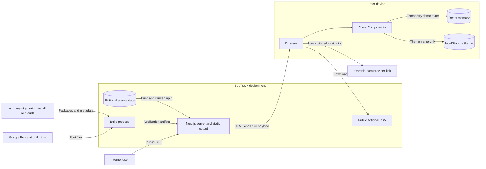
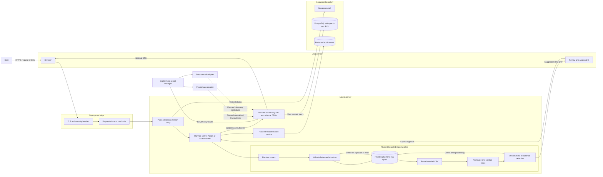

# SubTrack threat model

Threat-model date: 2026-09-17

## Purpose and scope

This threat model covers the public fictional Phase 1 application and the planned trust boundaries for Supabase authentication, private persistence, and statement processing. Planned components are design targets, not implemented controls.

The model uses STRIDE:

- **Spoofing:** Pretending to be another user, service, or trusted provider.
- **Tampering:** Changing records, requests, files, configuration, or audit evidence.
- **Repudiation:** Denying an action when reliable evidence is absent.
- **Information disclosure:** Exposing identity, financial, session, or secret data.
- **Denial of service:** Exhausting application, parser, database, or provider capacity.
- **Elevation of privilege:** Gaining operations or data beyond the caller's authorization.

## System inventory

### What exists now

- Public Next.js routes for landing, dashboard, subscriptions, subscription details, import preview, calendar, savings, and settings.
- Server-rendered and statically generated pages using fictional source data.
- Client Components for navigation, theme selection, filtering, review decisions, savings selection, and temporary preferences.
- React component memory for demo interactions.
- A `next-themes` local-storage entry containing only the selected theme.
- A public fictional CSV sample.
- A user-initiated external link to fixed `https://example.com` provider URLs.
- Build-time Google font retrieval through `next/font`, with self-hosted browser delivery.

### What is partially scaffolded

- Zod defines a subscription schema, but there is no untrusted request boundary yet.
- Product and architecture documents describe authentication, RLS, logging, import stages, deletion, and provider interfaces, but none is executable.
- The import page demonstrates review decisions but has no file input or parser.
- The settings form changes local React state only.

### What is planned

- Supabase Auth with server-verified cookie sessions.
- PostgreSQL tables protected by grants, RLS, and server ownership checks.
- A server-only DAL returning minimal DTOs.
- Server Actions or route handlers for validated mutations.
- A bounded CSV import pipeline with temporary raw-data handling.
- Structured redacted security audit events.
- Account export, account deletion, and retention processing.
- Future bank and email adapters, which are outside the first release.

## Assets

| Asset                                             | Sensitivity    | Current state             | Required protection                                                             |
| ------------------------------------------------- | -------------- | ------------------------- | ------------------------------------------------------------------------------- |
| User identity and verified email                  | High           | Not implemented           | Server-verified authentication, generic responses, minimal disclosure           |
| Authentication and refresh sessions               | Critical       | Not implemented           | Secure cookie, verification, rotation, revocation, no browser storage or logs   |
| User profile and preferences                      | Medium         | Fictional/local only      | Owner authorization, minimal DTO, export and deletion                           |
| Subscription records                              | High           | Fictional source fixture  | Owner authorization, RLS, integrity, minimal browser exposure                   |
| Transaction records and merchant descriptions     | High           | Fictional sample only     | Owner isolation, redaction, bounded retention, no analytics or AI transfer      |
| Uploaded financial statement                      | High           | No upload exists          | Strict limits, private ephemeral handling, guaranteed cleanup paths             |
| Import metadata and mappings                      | Medium to High | Not implemented           | Owner isolation, deduplication, safe errors, retention                          |
| Merchant aliases                                  | Medium         | Not implemented           | Owner isolation; shared aliases require a separate trust model                  |
| Price history                                     | High           | One fictional prior price | Integrity, owner isolation, confirmation workflow                               |
| Reminder records                                  | Medium         | Fictional UI only         | Owner isolation, safe delivery, no sensitive payload in notifications           |
| Budget and savings values                         | High           | Fictional/local only      | Owner isolation, no logs, accurate integer calculations                         |
| Cancellation URLs, instructions, phone, and notes | Medium to High | Fixed example URL only    | HTTPS allowlist, provenance, owner authorization, anti-phishing copy            |
| Audit events                                      | High           | Not implemented           | Append orientation, tamper resistance, strict read access, no sensitive content |
| Environment and Supabase secrets                  | Critical       | Placeholders only         | Secret manager, server-only import boundary, rotation, least privilege          |
| Future bank connection tokens                     | Critical       | Not implemented           | Provider adapter isolation, encryption, revocation, never bank credentials      |
| Future email access tokens                        | Critical       | Not implemented           | Minimal scopes, adapter isolation, encryption, revocation                       |
| Source, lockfile, and build artifacts             | High           | Local workspace           | Version control integrity, reviewed changes, clean reproducible build           |

## Threat actors

| Actor                                      | Capability and motivation                                                                                    |
| ------------------------------------------ | ------------------------------------------------------------------------------------------------------------ |
| Unauthenticated internet user              | Enumerates routes, sends crafted requests, frames pages, probes errors, and automates abuse                  |
| Malicious authenticated user               | Controls valid account inputs and identifiers and attempts horizontal access to another user's data          |
| Attacker with a stolen session             | Acts as the victim until revocation or expiry and attempts sensitive operations                              |
| Malicious uploaded file                    | Exploits parser ambiguity, resource use, formula handling, logs, or stored rendering                         |
| Compromised dependency                     | Executes during install/build or in the server/browser with package privileges                               |
| Accidental developer exposure              | Commits secrets, logs financial data, uses real fixtures, or sends data to an unapproved service             |
| Misconfigured deployment                   | Caches private responses, omits TLS/security headers, exposes debug output, or grants public database access |
| Overprivileged database client             | Uses a server secret or broad grant to bypass RLS and affect many users                                      |
| Curious or malicious support administrator | Searches or exports user financial data beyond a support purpose                                             |
| Automated bot                              | Brute-forces authentication, floods imports, enumerates accounts, or consumes provider quotas                |

## Entry points

### Current

- HTTP `GET` requests to eight public routes and seven statically generated detail paths.
- Client-side filter, checkbox, and preferences controls with no server effect.
- Public download of the fictional CSV.
- User click on a provider link.
- npm install/build/test toolchain and its package lifecycle scripts.

### Planned

- Sign-up, sign-in, sign-out, password reset, session refresh, and account deletion.
- Protected page reads and every Server Action or route handler.
- Dynamic subscription identifiers and other record IDs.
- Supabase Data API access through the public publishable key.
- CSV file body, filename, metadata, mapped headers, and parsed cells.
- Data export.
- Cancellation URLs and user notes.
- Administrative support tools and audit review.
- Future bank and email OAuth callbacks, tokens, and webhooks.

## Trust boundaries

1. **Internet to deployment edge:** Untrusted requests cross TLS termination, request-size policy, and rate limiting.
2. **Browser to Next.js server:** Cookies, form data, route parameters, headers, and files remain untrusted even when sent by an authenticated browser.
3. **Server Component to Client Component:** Every prop crossing this boundary becomes browser-accessible serialized data.
4. **Server entry point to DAL:** Authentication, authorization, validation, and transaction boundaries must occur before data access or mutation.
5. **DAL to Supabase Auth and PostgreSQL:** User-scoped access requires verified claims, minimal grants, and RLS; an elevated secret bypasses RLS.
6. **Import handler to parser:** Raw bytes are hostile and can consume CPU, memory, disk, or parser state.
7. **Parser to normalized domain:** Parsed strings remain untrusted and can attack HTML, URLs, logs, exports, or deduplication logic.
8. **Application to logs and audit store:** Event data can leak sensitive content or inject forged records unless allowlisted and encoded.
9. **Application to external providers:** Bank, email, notification, and analytics providers create new confidentiality and availability dependencies.
10. **Developer/CI to package registry and artifacts:** Dependencies and lifecycle scripts execute with developer or build permissions.

## Current Phase 1 data flow

Current trust observations:

- All product records are fictional and intentionally public.
- The browser receives full fictional subscription records on two routes.
- No browser request can persist a product change.
- No user identity or financial secret crosses a runtime network boundary.
- Package retrieval and build-time font retrieval remain supply-chain boundaries.

## Planned private-data and import flow

The following diagram spans Phase 2 authentication and persistence plus the Phase 4 statement workflow. Dashed components are planned.

## Threat scenarios

Likelihood and impact describe the system after the relevant feature exists. They do not assert current Phase 1 exploitability.

| ID    | STRIDE and actor                                         | Asset, entry point, and boundary                            | Attack scenario                                                                                                              | Existing control                                                                                         | Missing control                                                                     | Likelihood | Impact   | Recommended mitigation and blocking phase                                                                                                                        |
| ----- | -------------------------------------------------------- | ----------------------------------------------------------- | ---------------------------------------------------------------------------------------------------------------------------- | -------------------------------------------------------------------------------------------------------- | ----------------------------------------------------------------------------------- | ---------- | -------- | ---------------------------------------------------------------------------------------------------------------------------------------------------------------- |
| TM-01 | Spoofing; unauthenticated user                           | Identity/session; auth endpoint; browser-to-server          | The attacker forges or replays cookie content and server code trusts unverified session data.                                | Supabase is selected; no session exists now.                                                             | Verified claims, cookie policy, rotation, expiry, revocation.                       | High       | High     | Use Supabase SSR and server `getClaims()` verification; test forged/expired/revoked sessions. Before Phase 2.                                                    |
| TM-02 | Spoofing; stolen-session attacker                        | Session and account; every protected operation              | A stolen session remains valid through logout, password reset, or excessive inactivity.                                      | No session exists now.                                                                                   | Idle/absolute expiry, logout invalidation, risk-event revocation, reauthentication. | Medium     | High     | Approve session lifecycle and step-up requirements; add direct-entry tests. Before Phase 2.                                                                      |
| TM-03 | Elevation and disclosure; malicious user                 | Any user-owned row; dynamic ID; server-to-DAL and DAL-to-DB | The user changes a record ID and reads or modifies another user's data.                                                      | Planned `user_id`, server checks, and RLS.                                                               | Per-operation policy, ownership query, two-user test.                               | High       | High     | Deny by default, authorize every object, use RLS and test owner/non-owner/anonymous cases. Phase 2.                                                              |
| TM-04 | Tampering; malicious user                                | Ownership fields; mutation input; browser-to-server         | The user supplies another `user_id` during create or update and reassigns a record.                                          | Zod is available.                                                                                        | Server-owned identity assignment and RLS `with check`.                              | High       | High     | Ignore client ownership fields, derive from verified claims, and test mass assignment. Phase 2.                                                                  |
| TM-05 | Elevation; overprivileged client or developer            | Supabase server secret; environment-to-DAL                  | A service secret is imported into browser code or used in normal requests, bypassing RLS.                                    | Placeholder is labeled server-only; architecture recommends user-scoped clients.                         | Enforced import boundary, key minimization, CI bundle/secret checks.                | Medium     | Critical | Do not provision elevated keys by default; isolate unavoidable use in `server-only` code; scan bundles and rotate on exposure. Phase 2.                          |
| TM-06 | Disclosure/spoofing; misconfigured deployment            | Session and private HTML; edge cache                        | A CDN caches private HTML or a refresh response with `Set-Cookie` and serves it to another user.                             | Current content is fictional; Next.js defaults production browser source maps off.                       | Protected cache policy and Supabase header propagation.                             | Medium     | Critical | Use request-bound rendering and `private, no-store`; preserve refresh cache headers; test through a cache. Phase 2.                                              |
| TM-07 | Denial of service; bot or malicious file                 | Import service; file body; edge-to-parser                   | Repeated oversized, deeply quoted, or oversized-field CSV files exhaust CPU, memory, or disk.                                | No upload exists; requirements mention limits.                                                           | Numeric limits, streaming, worker timeout, concurrency and rate limits.             | High       | High     | Enforce the proposed import budget below before body buffering and parser execution. Phase 4.                                                                    |
| TM-08 | Tampering/injection; malicious file                      | Merchant text and headers; parser-to-domain/log/browser     | A cell contains HTML, controls, bidi characters, or CR/LF sequences that attack rendering, logs, or reviewer interpretation. | React escapes JSX; current source has no logs or raw HTML.                                               | Canonical validation, Unicode/control policy, log encoding, confusable review.      | Medium     | High     | Normalize and validate every field; render as text; sanitize logs; retain original only ephemerally. Phase 4.                                                    |
| TM-09 | Injection; malicious user or file                        | CSV export; domain-to-spreadsheet                           | Formula-prefixed merchant or note data executes when an exported CSV opens in spreadsheet software.                          | No export exists; requirements mention formula protection.                                               | Target-specific export escaping and tests.                                          | Medium     | High     | Quote every cell and apply documented spreadsheet-safe neutralization at export time for formula and control prefixes. Before any CSV export.                    |
| TM-10 | Tampering/disclosure; malicious user                     | Import hash and rows; DAL-to-DB                             | Races or globally scoped hashes let one user suppress, infer, merge, or approve another user's import.                       | Deduplication is planned.                                                                                | User-bound unique constraints, transaction, idempotency key, ownership checks.      | Medium     | High     | Scope hashes and unique keys to verified user, process atomically, and test concurrency and two-user collisions. Phase 4.                                        |
| TM-11 | Disclosure; misconfiguration or support actor            | Raw statement; parser temporary storage                     | Raw files remain after error, timeout, restart, or support debugging and become readable later.                              | Design requires raw deletion.                                                                            | Concrete storage, expiry, recovery cleanup, backup exclusion, proof tests.          | Medium     | High     | Use generated IDs in private bounded ephemeral storage, no backup/web access, and cleanup on every terminal path plus sweeper. Phase 4.                          |
| TM-12 | Tampering/elevation; compromised dependency              | Source, CI credentials, artifact; registry-to-build         | A malicious dependency or lifecycle script steals tokens or modifies output.                                                 | Lockfile integrity, registry-only sources, zero advisories, production signatures verified.              | Complete provenance policy, isolated CI, continuous monitoring.                     | Medium     | High     | Use clean locked installs, least-privilege CI tokens, package-change review, and advisory/provenance gates. Before public deployment.                            |
| TM-13 | Disclosure/repudiation; support administrator            | User records and audit logs; support tooling                | Support staff browse or export financial details without a documented purpose or attribution.                                | No support tooling exists.                                                                               | Roles, purpose limitation, masked DTOs, approval, access audit.                     | Medium     | High     | Create separate support roles and views, default-deny access, prohibit impersonation by default, and audit every access. Before support tooling.                 |
| TM-14 | Denial of service/spoofing; automated bot                | Auth, reset, import, export; internet-to-edge               | Automation enumerates accounts, guesses passwords, floods imports, or consumes provider quotas.                              | No sensitive endpoint exists.                                                                            | Generic auth responses, layered rate limits, abuse signals, alerts.                 | High       | High     | Apply account and network-aware throttles, bounded queues, generic errors, monitoring, and provider quota controls. Phase 2 for auth; Phase 4 for imports.       |
| TM-15 | Tampering/repudiation; malicious user or admin           | Audit events; DAL-to-audit store                            | An actor edits or deletes evidence of export, deletion, failed access, or administrative reads.                              | Append-oriented audit is planned.                                                                        | Restricted grants, integrity protection, retention, alerting, clock sync.           | Medium     | High     | Deny user writes, append through controlled server path or trigger, restrict readers, and monitor deletion/tampering. Phase 2.                                   |
| TM-16 | Spoofing/injection; compromised guide author             | Cancellation URL; database-to-browser                       | A trusted-looking guide directs the user to a malicious or non-HTTPS destination.                                            | Current URL is fixed HTTPS and new-tab link uses `noreferrer`; copy says provider confirms cancellation. | Protocol allowlist, provenance, moderation, verification date, report flow.         | Medium     | High     | Permit HTTPS, reject credentials/controls, display destination host, track provenance, and revalidate shared content. Phase 3/6.                                 |
| TM-17 | Disclosure/elevation; provider compromise or developer   | Bank/email tokens; provider adapter boundary                | An overly broad token leaks through logs, browser props, database query, or support tooling.                                 | Interfaces are planned; integrations are deferred.                                                       | Scope inventory, encryption, adapter isolation, rotation/revocation, vendor review. | Medium     | Critical | Request minimum read-only scopes, isolate secrets, never return tokens, revoke on disconnect, and threat-model each provider. Future integration gate.           |
| TM-18 | Disclosure/injection; malicious input or developer error | Logs/errors; application-to-log/user                        | A stack trace, request body, transaction description, or token reaches logs or a user-facing error.                          | Requirements prohibit sensitive logging; no current logger exists.                                       | Structured allowlist, redaction, generic errors, tests.                             | Medium     | High     | Implement one tested security-event API and safe error mapping; prohibit bodies and secrets. Phase 2/4.                                                          |
| TM-19 | Tampering; unauthenticated site                          | State-changing operation; browser-to-server                 | A cross-site request triggers a mutation through ambient cookies.                                                            | No mutation exists; Next.js Server Actions use POST and compare origin/host.                             | Per-entry auth, CSRF design for handlers, SameSite policy, allowed-origin review.   | Medium     | High     | Use POST-only mutations, verify session and origin, keep SameSite defense in depth, and test cross-origin requests. Phase 2.                                     |
| TM-20 | Disclosure/elevation; third-party script compromise      | Browser DOM and session-bound UI; external script boundary  | Analytics or a tag manager reads financial content from the DOM and sends it to a vendor.                                    | No runtime third-party script exists; fonts are self-hosted.                                             | Policy preventing unreviewed scripts and analytics on private pages.                | Medium     | High     | Default to no third-party runtime script on authenticated pages; require vendor/data-flow review, CSP, and minimal server-side events. Before public deployment. |

## Planned RLS verification matrix

All rows below assume these baseline controls:

- RLS enabled and forced where appropriate.
- Existing `anon` and `authenticated` grants revoked before least-privilege grants are added.
- Policies explicitly target `authenticated`.
- `user_id` comes from verified `auth.uid()`, not trusted client input.
- Anonymous and non-owner access is denied for every operation.
- `select`, `insert`, `update`, and `delete` policies are separate.
- Update uses both `using` and `with check`.
- Policy columns have supporting indexes.
- Every allowed write test uses `returning`; every denied write proves the target row stayed intact.

`Allow` means the owner can perform the operation through an approved application path. `Deferred` means the table receives no client-role grant until its owning feature phase.

| Table                        | Owner select                                    | Owner insert   | Owner update   | Owner delete                   | Anonymous | Other user | System and verification notes                                                                                  |
| ---------------------------- | ----------------------------------------------- | -------------- | -------------- | ------------------------------ | --------- | ---------- | -------------------------------------------------------------------------------------------------------------- |
| `profiles`                   | Allow                                           | Allow self row | Allow self row | Allow through account deletion | Deny all  | Deny all   | Unique `user_id`; test attempted ownership reassignment and account cascade                                    |
| `subscriptions`              | Allow                                           | Allow          | Allow          | Allow                          | Deny all  | Deny all   | Server overwrites `user_id`; distinguish archive, delete, and provider cancellation                            |
| `transactions`               | Deferred to Phase 4                             | Deferred       | Deferred       | Deferred                       | Deny all  | Deny all   | Create locked table in Phase 2 if required, but grant no client operation until import policy is reviewed      |
| `statement_imports`          | Deferred to Phase 4                             | Deferred       | Deferred       | Deferred                       | Deny all  | Deny all   | Hash uniqueness includes owner; raw bytes never stored in this table                                           |
| `import_column_mappings`     | Deferred to Phase 4                             | Deferred       | Deferred       | Deferred                       | Deny all  | Deny all   | Mapping ownership must agree with parent import; reject cross-owner foreign keys                               |
| `merchant_aliases`           | Deferred to Phase 4                             | Deferred       | Deferred       | Deferred                       | Deny all  | Deny all   | Keep user aliases separate from any future moderated global aliases                                            |
| `subscription_price_history` | Deferred to Phase 5                             | Deferred       | Deferred       | Deferred                       | Deny all  | Deny all   | Prefer append through a controlled domain operation; users confirm but do not rewrite history silently         |
| `reminders`                  | Deferred to Phase 5                             | Deferred       | Deferred       | Deferred                       | Deny all  | Deny all   | Notification worker access needs a separate minimal role and redacted payload                                  |
| `budgets`                    | Deferred to Phase 5                             | Deferred       | Deferred       | Deferred                       | Deny all  | Deny all   | Unique active budget per user/currency as product rules require                                                |
| `savings_goals`              | Deferred to Phase 5                             | Deferred       | Deferred       | Deferred                       | Deny all  | Deny all   | Realized savings changes only through confirmed subscription state transition                                  |
| `cancellation_guides`        | Deferred to Phase 6                             | Deferred       | Deferred       | Deferred                       | Deny all  | Deny all   | User-owned guides and future community guides require separate tables or explicit moderation states            |
| `audit_events`               | Deny direct table access; optional filtered DTO | Deny           | Deny           | Deny                           | Deny all  | Deny all   | Append through a controlled server operation or database trigger; no service key in normal browser-facing path |

For every table, pgTAP must test:

1. `anon` cannot select, insert, update, or delete.
2. The owner can perform only the operations marked `Allow`.
3. Another authenticated user cannot read or mutate the owner's row.
4. The owner cannot assign or change ownership to another user.
5. A denied update or delete leaves the target row unchanged.
6. Parent-child foreign keys cannot connect rows owned by different users.
7. Views use `security_invoker = true` or remain outside exposed schemas.
8. Security-definer functions live in a private schema, set an empty `search_path`, use schema-qualified names, and expose only necessary execution grants.

## Planned statement import security contract

These values are conservative starting limits for a personal statement import. Load tests can lower them. Raising them requires a reviewed resource model.

| Control           | Proposed first-release rule                                                                                                                                                      |
| ----------------- | -------------------------------------------------------------------------------------------------------------------------------------------------------------------------------- |
| Authentication    | Verify the session before reading the request body                                                                                                                               |
| Authorization     | Bind every import and derived row to the verified user; never trust submitted `user_id`                                                                                          |
| Rate limit        | Maximum five attempts per account per hour, one active import per account, plus network-level abuse detection                                                                    |
| Request body      | Stream and stop at 5 MiB; reject missing or excessive `Content-Length` where available but do not trust it alone                                                                 |
| File count        | Exactly one file per import request                                                                                                                                              |
| Extension         | Decoded final extension must be exactly `.csv`; reject double extensions, null bytes, leading dots, and path components                                                          |
| Filename          | Do not store or use the supplied filename for paths; retain at most a sanitized display label of 128 characters if product-approved                                              |
| MIME              | Allow `text/csv` and narrowly documented compatibility values only as a hint; never trust MIME as proof                                                                          |
| Signature         | CSV has no reliable magic signature; validate bounded textual structure instead of claiming signature verification                                                               |
| Encoding          | UTF-8 with an optional UTF-8 BOM only for the first release; reject invalid byte sequences, UTF-16/32, null bytes, and unsupported encodings                                     |
| Delimiter         | Comma only in the first release; add other delimiters through separately tested adapters                                                                                         |
| Rows              | At most 10,000 data rows after one header row                                                                                                                                    |
| Columns           | At most 64 columns                                                                                                                                                               |
| Line length       | At most 64 KiB decoded                                                                                                                                                           |
| Field length      | At most 8 KiB decoded; use tighter canonical limits after mapping                                                                                                                |
| Headers           | At most 128 Unicode code points each; reject empty or duplicate normalized headers                                                                                               |
| Parser            | Maintained RFC 4180-capable parser in streaming mode; no ad hoc splitting                                                                                                        |
| Resource budget   | Terminate a worker after 5 seconds and cap per-job memory near 64 MiB; keep the request queue bounded                                                                            |
| CSV structure     | Reject unterminated quotes, inconsistent row shape beyond a documented tolerance, excessive blank rows, and unexpected trailing data                                             |
| Unicode           | Normalize canonical text to NFC; remove or reject nulls and disallowed controls; collapse merchant-description whitespace; preserve a review-safe representation                 |
| Canonical fields  | Zod-valid date, description, signed integer minor units, currency, and source row number; reject overflow and ambiguous numeric formats                                          |
| Mapping           | Require explicit user mapping and a bounded preview before detection; never infer a high-impact field silently                                                                   |
| Temporary storage | Prefer bounded memory or a private generated-name directory outside webroot; no original filename, public URL, backup, or cross-job reuse                                        |
| Deduplication     | Cryptographic import and row fingerprints scoped to user; unique constraints and one transaction make retries idempotent                                                         |
| Detection         | Pure deterministic rules operate only on normalized rows and cannot create a subscription                                                                                        |
| Approval          | User must confirm, edit, merge, reject, or defer every candidate before persistence as a subscription                                                                            |
| Cleanup           | Delete raw bytes after parse, rejection, timeout, exception, process recovery, and success; run an expiry sweeper as a backstop                                                  |
| Rendering         | Treat descriptions and headers as text; never use raw HTML; validate any derived URL separately                                                                                  |
| Logging           | Record opaque import ID, event type, safe status, counts, duration bucket, and safe error code only                                                                              |
| Antivirus         | Local scanning can supplement controls, but CSV has no reliable active-content signature; never send statements to a public scanning service                                     |
| Export            | Apply target-specific formula neutralization to every untrusted cell at export time, including `=`, `+`, `-`, `@`, tab, CR, LF, and full-width variants; quote and escape fields |
| User errors       | Return generic safe codes without raw rows, filenames, parser stacks, paths, or encodings beyond actionable supported-format guidance                                            |
| Privacy notice    | Explain processing, retained normalized data, raw deletion, limitations, and the prohibition on real data until the feature passes its gate                                      |

## Existing and planned control map

| Control area        | Exists now                                                    | Required next                                                                |
| ------------------- | ------------------------------------------------------------- | ---------------------------------------------------------------------------- |
| Input encoding      | React text escaping; static Zod fixture                       | Server validation at every boundary; URL and CSV-specific schemas            |
| Authentication      | None by design                                                | Supabase SSR verified claims and session lifecycle                           |
| Authorization       | None needed for fictional public data                         | DAL ownership checks plus deny-by-default grants and RLS                     |
| Data minimization   | Fictional data only                                           | Route-specific SQL selection and DTOs                                        |
| Secrets             | Placeholders and ignored environment files                    | Deployment secret manager and server-only access                             |
| Browser storage     | Theme name only                                               | Keep all session and financial values out of web storage                     |
| Logging             | No application logs                                           | Structured allowlisted events, redaction, integrity, retention, and alerts   |
| File handling       | Public fictional download only                                | Bounded authenticated import pipeline and cleanup proof                      |
| Dependency controls | Lockfile, integrity, audit, production signature verification | Continuous monitoring, isolated CI, reviewed lifecycle changes               |
| Browser headers     | Not configured                                                | Tested CSP and supporting response headers                                   |
| Error handling      | Framework 404 for unknown demo ID                             | Generic mapped errors, stable codes, rollback, and secure exceptional paths  |
| Privacy             | Fictional-only warning and cancellation disclaimers           | Approved inventory, retention, export, deletion, and support-access controls |

## Residual risks

Even after the planned controls:

- A stolen valid session can act as the user until detection, expiry, or revocation.
- RLS and DAL bugs can coincide; independent tests and periodic review reduce but do not eliminate this risk.
- A parser or dependency can have an unknown vulnerability despite current advisory results.
- Merchant normalization and recurrence rules can produce false positives; mandatory user approval limits the consequence.
- Cancellation instructions can become stale or providers can change destinations; verification dates and user warnings remain necessary.
- Local device compromise, malicious browser extensions, and screenshots can expose data already displayed to the user.
- A support or deployment administrator with legitimate infrastructure access remains an insider risk; least privilege and tamper-resistant auditing reduce it.
- Future bank and email providers add vendor, OAuth, webhook, availability, and data-retention risks that require separate threat models.

## Review triggers

Update this threat model before:

- Adding or changing authentication, session, password-reset, or account-deletion behavior.
- Creating a database table, view, function, RLS policy, or elevated database client.
- Adding any Server Action, route handler, proxy, webhook, or background worker.
- Accepting a file or exporting CSV.
- Adding analytics, monitoring scripts, email, bank, or notification providers.
- Adding shared household data, support impersonation, or community cancellation content.
- Changing caching, CDN, deployment, secret, backup, or retention behavior.
- Introducing a new parser, direct dependency, lifecycle script, or external runtime destination.
